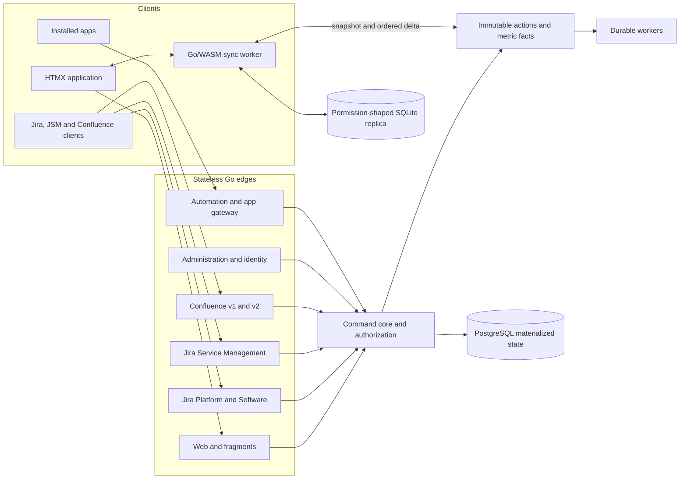

# ZZIRA — Jira Cloud completion plan

Updated: 2026-09-07

ZZIRA is a self-hosted work, service, knowledge, and administration platform.
The active program targets the reproducible public surface of Jira Cloud,
Jira Software, Jira Service Management, Confluence Cloud, Automation, Atlassian
administration, and installable apps. Delivery is one reviewable pull request
whose commits remain independently buildable.

**Stack:** Go + PostgreSQL · HTMX · browser-local SQLite through Go/WASM and
OPFS · one Go renderer shared by the server and browser worker.

The current handoff is [docs/CONTINUITY.md](docs/CONTINUITY.md). API scope and
implementation evidence live in [docs/CLOUD_PARITY.md](docs/CLOUD_PARITY.md),
[api/conformance/cloud-operations.json](api/conformance/cloud-operations.json),
and [api/conformance/MATRIX.md](api/conformance/MATRIX.md). User journeys live
in [docs/UI_PARITY.md](docs/UI_PARITY.md).

## Engineering rules

- **No fallbacks.** Invalid or unsupported input returns an explicit error. A
  provider or external service that is not configured does not silently change
  behavior.
- **No deferrals inside a delivered slice.** Do not merge TODO stubs,
  placeholder controls, success responses without semantics, or routes waiting
  for a later data path.
- **No dead code.** Every production path is exercised by the product or a
  contract test. Do not retain speculative branches or unused symbols.
- **No swallowed errors.** Return, wrap, log, or handle an error exactly once.
- **One mutation path.** Browser and public APIs call the same command code.
  State and its immutable action record commit in one database transaction.
- **Permission-shaped data.** REST, web, search, reports, sync, exports, apps,
  and background jobs evaluate the same authorization model.
- **One complete PR.** The requested release stays in one branch and one PR.
  Commits are ordered vertical slices so review, testing, and bisection remain
  practical.

## Compatibility boundary

The contract snapshot date is 2026-09-06. The generated inventory must include:

1. Jira Cloud Platform REST v3.
2. Jira Software Cloud REST, including Agile and development integrations.
3. Jira Service Management Cloud REST.
4. Confluence Cloud REST v2 and the remaining v1-only operations.
5. Automation REST rule management, manual rules, and templates.
6. Public organization administration operations that can be served by ZZIRA.
7. Installable app contracts whose host, lifecycle callbacks, storage, webhooks,
   and REST calls can be directed to a ZZIRA site.

Site-scoped clients must work by replacing their Jira or Confluence base URL.
Atlassian identity and organization clients that hardcode
`auth.atlassian.com` or `api.atlassian.com` additionally require an endpoint
override. ZZIRA exposes equivalent local endpoints but cannot redirect a host
compiled into another product.

Atlassian billing, proprietary AI models, and Atlassian's hosted Forge compute
are external service boundaries. ZZIRA must expose explicit capabilities and
errors for these boundaries; it must not report successful local emulation when
the service is absent. A ZZIRA app runtime covers locally executable modules.

An inventory entry is not complete because its route returns 2xx. Completion
requires the documented request and response shapes, headers, pagination,
expansion, permissions, errors, state transitions, and relevant concurrency
semantics.

## Current baseline

| Surface | Delivered foundation | Principal gap |
|---|---|---|
| Identity | Password, API tokens, sessions, simultaneous generic OIDC, Google and tenant-scoped Microsoft OIDC, Atlassian OAuth 2.0 3LO, encrypted custom OIDC registration/rotation/deletion, durable provider availability, profile-based identity connect/review/unlink, issuer-scoped revocation, login audit and back-channel logout | Organization/site/product lifecycle and enterprise federation policy |
| Work management | Projects, issues, sub-task hierarchy, comments, attachments, worklogs, links, watchers, issue-bound Advanced Forms, custom fields, security levels, notifications | Remaining Jira v3 operations, complete JQL/ADF, higher-level hierarchy, schemes and admin semantics |
| Agile | Boards, backlog, sprints, ranking, quick filters, swimlanes, WIP limits | Board administration, epics, estimates, capacity, plans, dependencies and reports |
| Workflows | Global and project-scoped status and workflow lifecycles with impact-safe deletion, isolated ownership and names, Jira scope resources, project-aware search and capability catalogs, atomic multi-status create/update/delete with simultaneous renames, versioned drafts, modern expansion, project-associated preview, structured validation and atomic workflow/status batches, designer metadata, a connected drag/keyboard designer with serialized saves and visual actor, API-only, field-value, previous-status, separation-of-duties, parent/child blocking, required-field, changed-field, single-value, regular-expression, date-comparison, date-window, history-validator, permission-validator, Advanced Forms attached/submitted validators, assignee, field-update, same-or-parent field-copy, durable registered-webhook and branch-created development triggers, and transition-screen controls, nested actor, request-source, typed field comparison and action-log history/actor conditions, role-backed Jira permission enforcement, ordered atomic post-functions, screen-authorized field/status changes and API round-tripping, active work-item migration with sync actions, directed topology, optimistic versions, active status safety, rollback and audit, paged usage, guarded deletion, impact preview, atomic status replacement, durable task execution/cancellation/recovery, explicit publish/discard, runtime isolation, and transition enforcement | Remaining system/ecosystem rule types, advanced parameters and exact team-managed workflow routing |
| Automation | Eight rule-management routes, fixed intervals, durable runs, JQL and three issue actions | Cron/events/manual triggers, conditions, branches, smart values, templates and action catalog |
| Releases | Version lifecycle, fix/affects membership, progress and notes | Ordering, related work, approvals, custom fields, exports and cross-project releases |
| Dashboards | CRUD, layouts, favourites, sharing and native issue gadgets | Full shares, subscriptions, report gadgets, app gadgets and offline data |
| Knowledge | Spaces, permission-filtered page, folder, Smart Link, database and whiteboard hierarchies, creator-private database/whiteboard containers, all documented whiteboard templates/locales, built-in classification state, safe external Smart Links, page editing, drafts, versions, trash, labels, threaded page/attachment footer comments, page inline discussions with exact-text anchors and resolution, assigned/due page tasks with completion, direct-user/group page restrictions, versioned attachment upload/download/properties/labels/thumbnails, hierarchical-content properties, public/private blog post create/read/update with version history, trash/restore/purge, labels, likes, operations, versioned properties, classification, guarded redaction and registered custom-content discovery, and durable page/space/label watches with in-app delivery across v1/v2; 167 Confluence operations reviewed | Remaining Confluence v1/v2, database schemas/rows/views, whiteboard canvas objects/editing, blog attachments/footer and inline comments and other non-page content, page children beneath non-page content, manual child ordering, organization-defined classification levels, storage-macro task extraction, rich anchor relocation, Confluence-specific space roles, mentions, watch email delivery, live collaboration, macros, CQL and export |
| Service management | Help center, service projects, seeded help/incident/problem/change request types with deterministic labels and related-work links, request-type-specific forms with typed custom fields, customer requests, participants, public/private conversation and attachments, assigned-user approvals, request subscriptions and inbox notifications, completed-request CSAT, status transitions, per-desk agents, built-in and manager-defined JQL queues, business calendars with holiday administration, ordered JQL-based conditional/default first-response and resolution SLA goals with stable cycle snapshots, durable escalation notifications, customer-only accounts, open/closed portal access, customer organizations, linked knowledge suggestions, request-type metadata/properties/permissions, Assets workspace discovery, filterable volume/SLA/CSAT reports with request-type and channel breakdowns, four-by-four operations risk, CAB policy and automatic approvals, on-call shifts, change planning, post-incident reviews, and all 75 pinned REST operations reviewed | Conditional/advanced portal fields, complete JQL beyond labels, SLA rule reordering and advanced criteria, approval configuration, email delivery, CSAT configuration, comparisons, SLA goal distributions, exports and scheduled report delivery, complete Assets APIs, dependency mapping, major-incident communications, change-conflict calendars and escalation policy |
| Analytics | Dashboard groupings, release progress, filterable service reports, and permission-filtered DORA deployment frequency, lead time, change failure rate and recovery time with daily evidence | Agile charts, richer historical reports, comparisons, targets, exports and scheduled delivery |
| Administration | All 47 organization operations reviewed with tested organization/site/product/directory, DNS claim, policy/resource, event, group and managed-account subsets; limited project settings | Runtime policy enforcement, provider administration and Jira/Confluence schemes |
| Apps | Webhooks and entity properties used by core features | Installation runtime, modules, isolation, storage, upgrades and app administration |
| Local-first | Issue replica and outbox, offline issue edits, authorization-before-replay, revoked-access replica/cache purge, tab isolation and reconnect convergence | Permission-shaped service, knowledge, report and administration data; replica schema upgrades and broader safe mutations |

The historical V0–V6 labels are retired. They described how the foundation was
built and no longer define the remaining product. Git history and release notes
retain that provenance.

## Architecture



### Invariants

- `internal/commands` is the only application layer that changes domain state.
- Every committed mutation appends one or more immutable, ordered actions in the
  same transaction.
- Replay is deterministic. Reconnect verifies authorization before outbox
  replay; loss of site access clears private materializations, queued commands,
  checkpoints, and authenticated caches before the browser signs out.
- Background work uses durable database queues, leases, bounded retries, and
  idempotent desired-state actions. Correctness cannot depend on an in-process
  timer.
- A historical chart is computed from timestamped facts. Current issue rows are
  never treated as historical evidence.
- Tenant, project, service-desk, space, content, issue-security, and customer
  boundaries are evaluated before data leaves the server.
- Pure packages needed by the browser worker cannot import server-only code. CI
  compiles the whole module for `GOOS=js GOARCH=wasm`.

### Domain boundaries

Server route registration and handlers are divided by product contract:

```text
internal/platform/      Jira platform and shared work items
internal/agile/         boards, sprints, plans and releases
internal/service/       portals, requests, queues, SLAs and Assets
internal/confluence/    knowledge content and collaboration
internal/automation/    rule definitions and durable execution
internal/identity/      providers, identities and account lifecycle
internal/admin/         organizations, sites, products, schemes and audit
internal/analytics/     facts, rollups, reports and exports
internal/apps/          installation, modules, storage and callbacks
```

Package movement happens only when a completed slice needs the new boundary;
there is no repository-wide rename with no user-visible result.

## Product journeys

Each journey has a browser test and API/state-transition tests using the same
command path.

| Persona | Required complete journey |
|---|---|
| Contributor | Sign in; find, create and triage work; plan a sprint; move work on a board; connect development evidence; work offline; prepare and follow a release |
| Product or project manager | Create a project; configure its model and access; plan hierarchy, capacity and dependencies; manage releases; publish dashboards and reports |
| Agile coach | Configure Scrum/Kanban behavior; inspect sprint, velocity, burn, flow and control reports; drill every measure into contributing work |
| Service customer | Discover a help center; search knowledge; submit a typed request; comment, attach, approve, follow status and leave feedback |
| Service agent or manager | Work queues; manage SLAs, incidents, problems, changes and approvals; collaborate privately; configure the service and inspect service reports |
| Knowledge collaborator | Create, organize, edit and discuss every supported content type; collaborate live; diagram; search; restrict, watch, export and restore content |
| Project or space admin | Manage people, roles, types, fields, schemes, workflows, forms, automation, templates, security and lifecycle |
| Site or organization admin | Manage sites, products, users, groups, providers, domains, tokens, policies, audit, retention, imports, exports and apps |

## UI system

ZZIRA keeps the current compact, sidebar-first interaction model and its own
assets. The base tokens are ink `#172033`, canvas `#f7f8fa`, surface `#ffffff`,
border `#dfe3ea`, action `#1769e0`, and accent `#6658d3`. Avenir Next/Segoe UI
Variable Display serves headings, Inter/system UI serves body text, and
SFMono/Consolas serves keys, queries, counts, and timestamps. Dark-mode semantic
tokens remain paired with the same roles.

The global shell gains a product switcher for **Work**, **Service**,
**Knowledge**, **Insights**, and **Admin**. Search, create, notifications, help,
and account controls keep stable positions. The context rail changes with the
selected product.

```text
┌ Product ─ Search ─ Create ─ Alerts ─ Help ─ Account ┐
├──────────────┬───────────────────────────────────────┤
│ Context rail │ Breadcrumb · identity · key actions  │
│              ├───────────────────────────────────────┤
│ Projects     │ Primary work surface                  │
│ Queues       │                                       │
│ Releases     ├───────────────────────────────────────┤
│ Reports      │ Evidence · activity · properties      │
│ Settings     │                                       │
└──────────────┴───────────────────────────────────────┘
```

The recurring visual element is an operating timeline joining work item, code,
build, deployment, incident, recovery, and release evidence. It appears in work
items, releases, service incidents, and DORA reports. Reports use dense chart and
table canvases with direct drill-down instead of interchangeable summary cards.
Every visualization includes a keyboard-operable accessible data table.

## One-PR execution map

Every numbered item is an ordered commit or small adjacent commit group. A
group delivers a usable vertical slice with migrations, command code, API,
browser UI, sync behavior where applicable, and tests.

1. **Contract and continuity.** Replace obsolete planning text, pin every target
   contract, generate the complete operation ledger, add coverage metadata and
   make CI reject stale or duplicate operations.
2. **Organizations and authorization.** Add organizations, sites, products,
   directories, groups, role bindings, permission schemes, shared evaluators,
   audit records, admin APIs and admin journeys. Migrate existing memberships.
3. **Provider-based authentication.** Add a provider registry, Google and
   Microsoft OIDC, Atlassian OAuth 2.0 3LO, issuer/subject account linking,
   provider administration, session revocation and login audit.
4. **Jira administration and workflows.** Complete roles, permissions,
   notifications, fields, contexts, screens, work types, workflow schemes,
   workflow drafts/publishing, conditions, validators, post-functions, project
   templates and lifecycle.
5. **Jira Platform completion.** Implement the remaining v3 contract, complete
   ADF and JQL, hierarchy, components, bulk operations, properties, votes,
   expansions, pagination, permissions and error semantics.
6. **Agile, plans and releases.** Complete board administration, epics,
   estimates, teams, capacity, parallel sprints, dependencies, timelines,
   scenarios, cross-project plans, version ordering, release governance and
   exports.
7. **Development facts.** Ingest development information, builds, deployments,
   feature flags, remote links, security and operations. Add immutable work,
   change, deployment and incident facts plus recalculation workers.
   The delivered slices persist sequence-ordered repositories, commits,
   branches and pull requests behind all six devinfo operations, plus builds
   and deployments behind all nine pinned CI/environment operations. Work
   items and releases expose the linked evidence, and branch creation can
   execute a workflow trigger.
8. **Reports and dashboards.** Add Agile and Jira reports, four DORA measures,
   service/release/automation/knowledge metrics, report exports, scheduled
   delivery, dashboard subscriptions, complete shares and report/app gadgets.
   The first DORA slice now persists immutable build/deployment updates and
   calculates deployment frequency, commit-to-production lead time, change
   failure rate and incident recovery time with permission filtering, selectable
   windows, an accessible chart/table and recent production evidence.
9. **Automation completion.** Add Cron, event, webhook and manual triggers;
   conditions, branches, smart values, related-object traversal, connections,
   templates, the product action catalog, quotas and complete audit controls.
10. **Service Management API.** Add service projects, customers, organizations,
    request types, dynamic forms, requests, queues, calendars, SLAs, approvals,
    participants, comments, attachments, feedback, incidents, problems, changes,
    knowledge links and Assets with the public REST contract.
    The foundation now creates service projects and desks atomically, seeds help
    and incident request types, exposes request field metadata, and implements
    the first nine pinned discovery and request-type operations. The customer
    slice adds portal-only identities, a help-center request journey, owned/all
    request reads, validation, public/internal conversations, workflow status
    transitions, and eleven more pinned request operations. Incident portal
    requests feed the existing DORA recovery measure through their backing Jira
    issue. The agent slices provision all-open, unassigned and assigned-to-me
    queues, implement the three pinned queue reads, add a responsive
    queue/assignment workspace, and enforce per-desk agent assignment across
    REST and web. Reporter/agent participant management adds the three pinned
    participant operations and participant-shaped request access. The first SLA
    slice adds configurable business calendars, durable first-response and
    resolution cycles, customer-visible clock state and both pinned SLA reads.
    The customer-directory slice adds durable portal-only activation and
    revocation, open/closed desk admission, direct customer membership,
    organizations, organization members/properties, desk links, and all pinned
    organization and customer lifecycle operations. The final contract slice
    adds request-type groups, permission checks and properties, linked
    Confluence knowledge search/viewing, portal suggestions, and durable Assets
    workspace discovery. All 75 pinned JSM operations now have reviewed
    implementation evidence.
11. **Service Management journeys.** Extend the delivered customer help center,
    typed request portal, owned request tracking, conversation, status flow and
    agent queue/assignment workspace with custom queues, an SLA timeline, service setup,
    incident/problem/change intake and linkage, conditional SLA goals and service reporting.
    Managers can now create, edit and delete validated JQL queues; agents use
    those views with permission-shaped service requests in JQL order, while
    built-in operational queues remain protected.
    Managers also configure ordered request-type forms with required/help state
    for summary, description, and project-available text, number, and date-time
    custom fields. The customer UI and JSM metadata use the same persisted
    contract, and answers flow into the canonical Jira issue.
    Calendar settings now include audited holiday add, rename and removal; SLA
    clocks, attention ordering and escalations skip those dates.
    The service report workspace now exposes selectable 7/30/90 day request
    intake, open/resolved load, SLA-breach and CSAT measures with an accessible
    daily chart, exact tables, request-type/channel breakdowns and persisted filters.
    Existing and new desks seed help, incident, problem and change intake; the
    latter two require descriptions, all operations requests receive stable Jira
    labels, and agents link visible related work from the request journey.
    Managers now configure a CAB risk threshold and roster, incident-review due
    period, and on-call shifts. Agents assess every operations request on a
    four-by-four risk matrix, capture change windows and rollback plans, assign
    on-call ownership, and track post-incident findings. High-risk changes create
    one approval for the CAB automatically, with all policy and assessment
    mutations written to the organization audit log.
12. **Confluence contract completion.** The delivered page foundation now covers
    v1 and v2 spaces and pages, permission-filtered page hierarchy, drafts,
    versions and trash, footer and inline comments, labels, restrictions,
    attachments, properties, thumbnails, watches, notifications and page tasks
    across 167 reviewed operations, including nested folders, Smart Links,
    creator-private databases and whiteboards, template/locale creation,
    classification state, versioned properties, and public/private blog post
    lifecycle with version history, labels and discovery, likes, permission
    operations, versioned properties, classification, guarded redaction and
    registered custom-content discovery. Continue with blog attachments, footer
    and inline comments, then other content types,
    followed by the remaining operations, space roles, CQL,
    templates, macros, imports, exports, analytics and audit.
13. **Knowledge collaboration and diagrams.** Extend the knowledge journey to
    live documents, enrich whiteboards with canvas objects and editing, enrich
    databases with schemas, rows and views, and add live
    editing, presence, diagrams, embedding, object links, accessible
    descriptions, and SVG/PNG/PDF export.
14. **App runtime.** Add installation lifecycle, signed callbacks, app
    identities, scopes, isolated storage, web items, panels, issue tabs,
    dashboard gadgets, workflow modules, custom fields, webhooks, scheduled
    triggers, upgrades, suspension, uninstall and app administration.
15. **Local-first completion and release hardening.** Materialize service,
    knowledge, reports and safe administration reads; finish offline queues and
    replica upgrades; run compatibility, migration, concurrency, accessibility,
    browser, security and load gates; regenerate all evidence.

## Durable workers

The completed product has explicit workers for automation schedules and events,
SLA clocks and calendars, metric rollups, search indexing, webhook/app delivery,
mail delivery, report subscriptions, exports/imports, retention, and attachment
processing. Each worker records attempts and terminal outcomes. Multi-replica
claims use row locking and leases. External delivery records idempotency keys.

## Completion gates

The PR is ready only when all of the following are true:

- The generated inventory includes every pinned target and has no unclassified
  operation inside the compatibility boundary.
- Contract tests cover request/response schemas, headers, pagination,
  expansions, permissions, failures, and state transitions.
- Generated Go, TypeScript, and Python clients pass after changing the service
  base URL. Representative configurable Jira clients pass smoke tests.
- Each persona journey passes in Chromium. Authentication, core work, service,
  knowledge, administration, and offline-critical journeys also pass in Firefox
  and WebKit.
- Keyboard use, focus order, names, contrast, 320px reflow, dark mode, reduced
  motion, screen-reader chart tables, locale, and timezone tests pass.
- Multi-user tests prove tenant, issue-security, customer, project, space,
  content-restriction, and app-storage isolation.
- Existing databases and browser replicas upgrade through every additive
  migration. Fresh schema, seed, and rollback-recovery tests pass.
- Workers pass lease, retry, duplicate-delivery, restart, cancellation, and
  poison-message tests.
- Go tests, WASM builds, Playwright, conformance, vet, CodeQL, Semgrep, gosec,
  govulncheck, npm audit, container build, and Trivy are green.
- Documentation, generated inventories, and user-facing capability descriptions
  match the shipped behavior. Review comments are answered in their existing
  threads and resolved.

## Decisions and risks

| Decision or risk | Treatment |
|---|---|
| One PR has a large review surface | Preserve the requested single PR while keeping dependency-ordered, green, bisectable commits and a generated review ledger |
| Public contracts change | Checksum-pin inputs; updating a pin produces a reviewed operation/schema diff |
| Current handler packages are growing | Split registration and translation by domain as each complete slice lands |
| Historical metrics cannot be reconstructed from current rows | Record immutable facts and derive rollups with versioned calculation rules |
| Rich collaborative editing adds multi-writer state | Persist ordered document operations, checkpoint snapshots, and test convergence before enabling live editing |
| Permissions cross every product | Centralize grants and role bindings; filter before serialization, indexing, sync, export or app delivery |
| External identity and delivery fail | Report actionable provider errors and durable failed attempts; never substitute another provider |
| Atlassian-hosted app behavior is not wholly portable | Test named modules and runtime services; distinguish local runtime support from external Atlassian services |

## Documentation ownership

- `PLAN.md`: stable architecture, execution order, rules, and final gates.
- `docs/CONTINUITY.md`: current branch state, last completed slice, active work,
  next command, and blockers. Update it with every meaningful commit.
- `docs/CLOUD_PARITY.md`: generated-contract totals, compatibility boundary, and
  product-surface status.
- `api/conformance/MATRIX.md`: delivered endpoint-group evidence.
- `docs/UI_PARITY.md`: persona journeys and browser evidence.
- Surface documents such as `AUTOMATION.md`, `DASHBOARDS.md`, and `RELEASES.md`:
  precise shipped semantics and limits for that domain.
