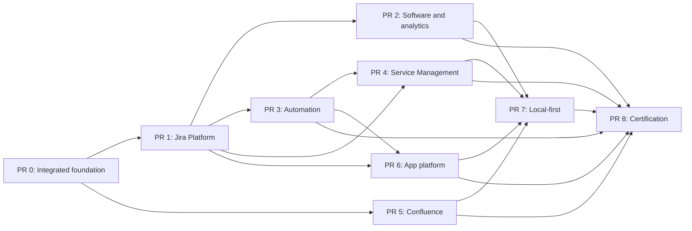
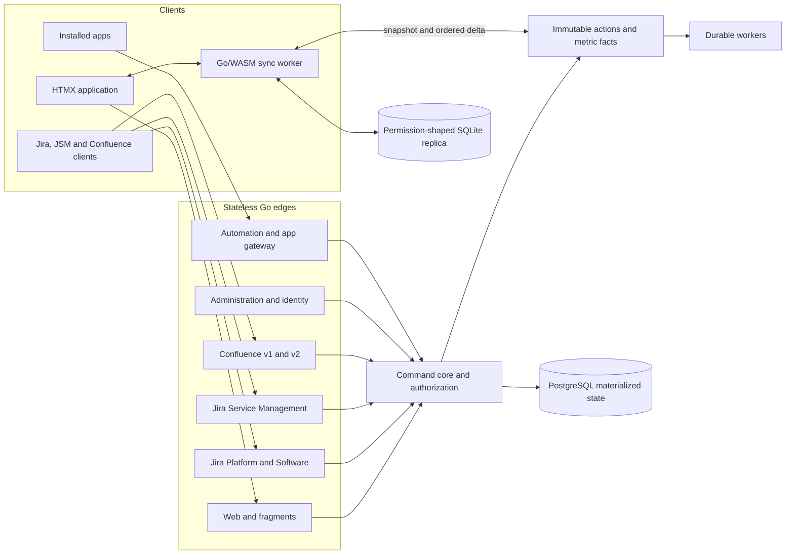

# ZZIRA — Jira Cloud compatibility roadmap

Updated: 2026-09-09

ZZIRA is a self-hosted work, service, knowledge, administration, analytics, and
app platform. The compatibility program targets the reproducible public surface
of Jira Cloud Platform, Jira Software, Jira Service Management, Confluence
Cloud, Automation, Atlassian administration, and installable apps.

Delivery is organized as a dependency-ordered series of large pull requests.
Each PR owns complete product slices across persistence, commands, public API,
browser UI, authorization, audit, workers, local-first behavior where relevant,
tests, and documentation. A route, page, or schema by itself is not a completed
slice.

**Stack:** Go + PostgreSQL · HTMX · browser-local SQLite through Go/WASM and
OPFS · one Go renderer shared by the server and browser worker.

## Sources of truth

- [docs/CONTINUITY.md](docs/CONTINUITY.md) is the short-lived handoff for the
  active branch and next checkpoint.
- [docs/CLOUD_PARITY.md](docs/CLOUD_PARITY.md) records product status, exact
  contract totals, and compatibility limits.
- [api/conformance/cloud-operations.json](api/conformance/cloud-operations.json)
  is the generated operation inventory.
- [api/conformance/cloud-coverage.json](api/conformance/cloud-coverage.json)
  records reviewed operation-level evidence.
- [api/conformance/MATRIX.md](api/conformance/MATRIX.md) groups delivered API
  slices without claiming full operation fidelity.
- [docs/UI_PARITY.md](docs/UI_PARITY.md) records persona journeys and browser
  evidence.

Detailed delivered-feature inventories belong in those ledgers and the
surface-specific documents. This roadmap owns sequencing, boundaries, and
acceptance gates; it does not duplicate every shipped endpoint or UI control.

## Compatibility boundary

The pinned contract snapshot includes:

| Contract | Operations |
|---|---:|
| Jira Cloud Platform REST v3 | 617 |
| Jira Software Cloud REST | 105 |
| Jira Service Management Cloud REST | 75 |
| Confluence Cloud REST v1 | 130 |
| Confluence Cloud REST v2 | 218 |
| Automation REST | 15 |
| Organizations REST | 47 |
| **Pinned total** | **1,207** |

The operation count is an inventory denominator, not an implementation count.
Connect descriptors and app modules require a separately versioned manual
contract ledger because Atlassian does not publish them as one OpenAPI document.

For site-scoped Jira Platform, Jira Software, Jira Service Management, and
Confluence APIs, compatible software must work after replacing the service base
URL while preserving its normal request behavior. Fidelity includes paths,
methods, authentication, bodies, status codes, headers, pagination, expansions,
identifiers, permissions, state transitions, and concurrency semantics.

Clients that hardcode `auth.atlassian.com` or `api.atlassian.com` need an
endpoint override because a site base URL cannot redirect those hosts. ZZIRA
provides local equivalents for compatible central-host operations.

Atlassian billing, proprietary AI models, and Atlassian-hosted Forge compute are
external service boundaries. Capability discovery must distinguish those
services from locally executable ZZIRA app runtime behavior and must return
explicit errors when an external capability is unavailable.

## Engineering and PR rules

- Invalid, unsupported, or unavailable behavior returns an explicit error. It
  does not silently change semantics or report false success.
- A delivered slice contains no TODO route, placeholder control, disconnected
  page, speculative production branch, or unexercised symbol.
- Browser and public APIs call the same command code. State and its immutable
  action record commit in one database transaction.
- REST, web, search, reports, replicas, exports, apps, and background workers use
  the same permission model and filter before serialization.
- Every background operation is durable, leased, bounded, retryable,
  observable, and idempotent. Correctness cannot depend on an in-process timer.
- Each checkpoint is committed. Commits remain independently buildable and are
  ordered so reviewers can follow migrations, commands, API, UI, and tests.
- Each PR updates the operation ledger, persona ledger, surface documentation,
  and continuity handoff for the behavior it changes.
- A PR closes its owned surface to the stated acceptance criteria. Known gaps
  discovered in that surface are implemented or recorded as explicit external
  boundaries before merge.

## PR 0 — Integrated Cloud foundation

PR 0 is the merged foundation on `main`. It establishes the shared substrate
on which the remaining PRs build.

It contains:

- the 1,207-operation pinned contract inventory, reviewed-coverage mechanism,
  parity ledgers, and CI freshness checks;
- organizations, sites, products, directories, managed accounts, groups,
  invitations, role bindings, domain claims, access policies, audit events, and
  the administration UI;
- password, API-token, generic OIDC, Google, Microsoft Entra ID, and Atlassian
  sign-in, identity linking, provider administration, and issuer-scoped
  revocation;
- Jira status, workflow, workflow-scheme, draft, publishing, migration,
  validation, transition-rule, task, permission, and visual designer slices;
- development-information, build, and deployment facts; issue and release
  evidence; initial DORA reporting; releases; and configurable dashboards;
- the current JSM public-contract assessment, help center, request, customer,
  agent, queue, SLA, approval, CSAT, operations, on-call, major-incident,
  service-topology, reporting, and initial Assets journeys;
- the current Confluence space, page, blog, folder, Smart Link, attachment,
  comment, restriction, task, watch, database, whiteboard, classification, and
  space-administration slices;
- the Connect-compatible installation, scope, app-principal, JWT/QSH, storage,
  lifecycle, webhook, schedule, navigation, project, issue, dashboard, report,
  field, property, content, context, glance, and administration foundations; and
- the associated migrations, command paths, permission enforcement, audit,
  browser journeys, conformance evidence, and documentation.

PR 0 does not claim complete Jira Cloud fidelity. Its merge result is the base
for the product-completion PRs below.

## Remaining PR roadmap

### PR 1 — Jira Platform and administration completion

This PR completes the Jira core and administrative model needed by the other
products.

Current delivery includes saved-filter administration and subscriptions,
stable enhanced search and Jira issue IDs, expanded built-in and app-provided
JQL, project components and default assignment, issue votes, durable login-date
functions, and the Jira Service Management approval and calendar-aware SLA
function families needed by shared search surfaces. Each is retained as an
independently validated checkpoint on the active PR 1 branch.

It contains:

- the remaining Jira Platform REST v3 operations, exact metadata, expansions,
  pagination, error, permission, and concurrency behavior;
- complete JQL grammar, operators, functions, history predicates, stable
  cursors, saved filters, shares, subscriptions, and bulk search behavior;
- complete ADF parsing, validation, storage, rendering, mentions, media, and
  conversion at every Jira field boundary;
- higher-level work hierarchy, components, estimates, votes, bulk work-item and
  property operations, notification preferences, and collaboration semantics;
- project roles, templates, lifecycle, archive and restore, team-managed and
  company-managed configuration, and project import/export;
- field, field-context, work-type, screen, permission, notification,
  issue-security, and workflow scheme administration with impact previews and
  audited migrations;
- runtime organization policy enforcement, remaining identity lifecycle and
  federation behavior, sessions, tokens, retention, recovery, and audit tools;
  and
- complete contributor, project-admin, site-admin, and organization-admin
  browser journeys for this surface.

**Exit condition:** Jira Platform and administration operations owned by this
PR have exact reviewed evidence, and the administrative configuration used by
later PRs is available through both API and UI.

### PR 2 — Jira Software, Plans, releases, dashboards, and analytics

This PR completes planning, delivery governance, and management insight on top
of PR 1.

It contains:

- board creation, ownership, movement, filtering, card configuration, Scrum and
  Kanban policy, estimation, epics, higher hierarchy, teams, capacity, parallel
  sprints, dependencies, dates, and cross-project plans;
- timelines, scenarios, baselines, forecasts, scope changes, dependency and
  capacity warnings, plan sharing, and plan export;
- sprint, velocity, burnup, burndown, cumulative-flow, control, cycle-time,
  throughput, created-versus-resolved, epic, version, forecast, and release
  reports backed by immutable historical facts;
- release ordering, related work, readiness, approvers, custom fields,
  cross-project releases, change evidence, notes, exports, and governance;
- complete dashboard ownership, group/project shares, archive and bulk actions,
  subscriptions, report gadgets, refresh behavior, exports, and offline-safe
  report reads;
- configurable DORA definitions, targets, comparisons, filters, team/service/
  release segmentation, evidence drill-down, exports, and scheduled delivery;
  and
- contributor, product-manager, project-manager, agile-coach, release-manager,
  and engineering-manager browser journeys, including accessible chart tables.

**Exit condition:** every aggregate drills into its contributing immutable
facts, all Jira Software operations are reviewed, and the complete planning to
release journey is browser-proven.

### PR 3 — Automation and workflow ecosystem

This PR completes rule authoring and durable execution across Work, Software,
Service, Knowledge, and installed apps.

It contains:

- Cron, event, webhook, manual, SLA, deployment, release, and scheduled triggers;
- conditions, nested branches, related-object traversal, smart values,
  templates, connections, secrets, quotas, and the supported action catalog;
- actor and permission semantics, run-as behavior, loop protection,
  idempotency, rate limits, retries, cancellation, recovery, and dead-letter
  administration;
- rule import/export, versioning, enable/disable, validation, test execution,
  audit detail, execution tracing, and actionable failure diagnostics;
- remaining system and ecosystem workflow conditions, validators,
  post-functions, advanced parameters, and exact team-managed routing;
- durable mail, subscription, scheduled report, retention, and product-event
  dispatch primitives shared by later PRs; and
- administrator and automation-author browser journeys from template selection
  through a verified scheduled or event-driven outcome.

**Exit condition:** every trigger and component has deterministic replay and
permission tests, worker restart/duplicate cases are proven, and all pinned
Automation operations have exact reviewed evidence.

### PR 4 — Jira Service Management completion

This PR completes the bundled Service Desk product using the Jira Platform,
analytics, and automation foundations.

It contains:

- branded help centers, portals, request types, conditional forms, validation,
  select/user/group/asset fields, localization, knowledge deflection, email
  intake, and customer notification preferences;
- customer accounts, organizations, participants, sharing, approvals,
  subscriptions, reopen rules, files, comments, feedback, and complete
  customer-visible status and SLA behavior;
- custom queues, complete JQL evaluation, bulk actions, routing, assignment,
  escalation, collaboration, and agent productivity journeys;
- calendars, ordered and reusable SLA policies, advanced goal criteria,
  pause rules, retroactive recalculation, distributions, breaches, and audit;
- incidents, problems, changes, risks, CABs, approvals, conflicts, on-call,
  escalation, command roles, stakeholder channels, post-incident reviews,
  dependencies, and service ownership;
- public Assets schema, type, attribute, object, relation, query, import,
  mapping, reconciliation, attachment, icon, permission, history, and workspace
  APIs plus management UI;
- service volume, demand, SLA, satisfaction, incident, change, asset, and team
  reports with comparisons, drill-down, exports, subscriptions, and schedules;
  and
- complete customer, agent, service-manager, incident-manager, change-manager,
  asset-manager, and service-admin browser journeys.

**Exit condition:** all 75 pinned JSM operations and the separately inventoried
Assets surface have exact reviewed evidence, and customer-to-resolution plus
incident/change/asset journeys are browser-proven.

### PR 5 — Confluence and knowledge collaboration completion

This PR completes the bundled wiki, structured knowledge, diagramming, and
collaboration surface.

It contains:

- every remaining Confluence v1/v2 operation and content type, heterogeneous
  children, ancestors and descendants, manual ordering, move/copy, archive,
  restore, retention, and lifecycle behavior;
- complete ADF and storage-format editing, conversion, macros, media, embeds,
  mentions, tasks, anchor relocation, templates, blueprints, and CQL;
- live documents, presence, concurrent operations, conflict recovery, ordered
  document history, drafts, publishing, comments, watches, notifications, and
  email delivery;
- advanced whiteboard objects, connectors, grouping, alignment, direct
  manipulation, keyboard editing, diagrams, graph layouts, Smart Links, and
  accessible text equivalents;
- database schemas, relations, formulas where reproducible, records, views,
  filtering, sorting, grouping, permissions, imports, and exports;
- space roles, restrictions, organization-defined classifications, templates,
  analytics, audit, import/export, backup/restore, and administrator journeys;
- SVG, PNG, PDF, and supported knowledge-format exports with permission-safe
  embedded Work and Service objects; and
- complete author, reviewer, knowledge-manager, space-admin, and site-admin
  browser journeys.

**Exit condition:** Confluence operations have exact reviewed evidence, live
collaboration converges under multi-user tests, and authoring through governance
and export is browser-proven.

### PR 6 — App platform and ecosystem compatibility

This PR completes locally executable Connect and compatible app-platform
behavior across Jira, JSM, Confluence, dashboards, workflows, and administration.

It contains:

- a versioned manual inventory for Connect descriptors, modules, conditions,
  callbacks, context parameters, permissions, and migration contracts;
- remaining global, site, project, space, page, issue, dashboard, report,
  workflow, field, search, navigation, administration, and dynamic modules;
- `configurePage`, configuration persistence, refresh, presence conditions,
  native and signed remote rendering, web-item locations and conditions, and
  module-specific validation;
- select and read-only fields, context and option APIs, bulk issue/entity
  properties, indexing, JQL integration, and upgrade migrations;
- webhook options, event filters, app schedules, lifecycle retries, scope-safe
  upgrades, rollback, uninstall cleanup, secret rotation, delivery inspection,
  and recovery;
- local hosted compute and event execution where reproducible, with explicit
  capability boundaries for Atlassian-hosted Forge services;
- developer and administrator consoles, app diagnostics, audit, permission
  review, tenant isolation, and resource limits; and
- compatibility fixtures for representative third-party apps and configurable
  Jira/JSM/Confluence API clients using a ZZIRA base URL.

**Exit condition:** every supported app contract is versioned and tested, app
isolation survives install/upgrade/suspend/uninstall/reinstall cases, and named
third-party compatibility fixtures pass.

### PR 7 — Local-first product completion

This PR extends the browser replica from core work items to the complete safe
product surface.

It contains:

- permission-shaped Service, Knowledge, Insights, release, dashboard, and safe
  administration snapshots and ordered deltas;
- queued offline mutations for product actions that can be reconciled without
  unsafe side effects, with explicit online requirements for the rest;
- entity-version conflicts, outbox ordering, cross-tab ownership, reconnect,
  compaction, attachment staging, quota handling, cache invalidation, and
  deterministic convergence;
- additive replica migrations, interrupted-upgrade recovery, downgrade refusal,
  full resnapshot, account/site switching, session loss, and immediate private
  data purge after access revocation; and
- offline and two-client browser journeys for contributors, agents, knowledge
  collaborators, managers, and administrators.

**Exit condition:** promised offline reads and writes work through reload,
disconnect, conflict, reconnect, role change, and revocation, and browser
replicas upgrade from every supported prior schema.

### PR 8 — Exact API closure and release certification

This PR closes cross-product gaps and produces the evidence required to call a
release compatible.

It contains:

- classification and review of all 1,207 pinned operations plus the manual app
  and Assets inventories, with no unassessed in-boundary operation;
- golden request/response, header, pagination, expansion, identifier,
  permission, error, transition, idempotency, and concurrency suites;
- generated Go, TypeScript, and Python client tests after changing only the site
  base URL, plus named configurable third-party client smoke tests;
- migration tests from every supported server and replica schema, fresh install,
  seed, backup, restore, rollback recovery, and mixed-version deployment checks;
- tenant, issue-security, project, customer, service, space, content-restriction,
  app-storage, export, search-index, report, and worker isolation tests;
- Chromium, Firefox, and WebKit persona suites; keyboard, screen-reader, focus,
  contrast, dark-mode, reduced-motion, 320px reflow, locale, and timezone checks;
- worker lease, retry, duplicate-delivery, restart, cancellation, poison-message,
  throughput, load, rate-limit, and failure-injection tests;
- security scanning, dependency and container review, deployment packaging,
  operator documentation, upgrade guidance, and final capability statements;
  and
- closure of CI failures and review conversations in their existing threads.

**Exit condition:** every compatibility claim is backed by current automated
evidence, every documented gap is an explicit external boundary, all required
checks pass, and the release can be installed and upgraded reproducibly.

## Dependency order



PRs 2, 3, and 5 may be developed concurrently after their direct prerequisites
merge. PR 4 consumes the shared Jira and automation semantics. PR 6 consumes
the final Jira and automation extension points. PR 7 integrates all product
data models, and PR 8 follows every product PR.

## Architecture invariants



- `internal/commands` is the only application layer that changes domain state.
- Every committed mutation appends immutable ordered actions in the same
  transaction.
- Historical charts derive from timestamped facts with versioned calculation
  rules; current materialized rows are not historical evidence.
- Reconnect verifies authorization before outbox replay. Losing access removes
  private replicas, queued commands, checkpoints, and authenticated caches.
- Tenant, project, service-desk, customer, issue-security, space, content, and
  app boundaries are evaluated before data leaves the server.
- Pure packages used by the browser worker cannot import server-only code. CI
  compiles the module for `GOOS=js GOARCH=wasm`.

Domain ownership remains:

```text
internal/platform/      Jira platform and shared work items
internal/agile/         boards, sprints, plans and releases
internal/service/       portals, requests, queues, SLAs and Assets
internal/confluence/    knowledge content and collaboration
internal/automation/    rule definitions and durable execution
internal/identity/      providers, identities and account lifecycle
internal/admin/         organizations, sites, products, schemes and audit
internal/analytics/     facts, rollups, reports and exports
internal/apps/          installation, modules, storage and callbacks
```

Package movement occurs when a completed product slice requires it. Avoid
repository-wide renames without a user-visible or contract-visible result.

## Product and interaction requirements

The global shell provides stable search, create, notification, help, and account
controls plus a product switcher for **Work**, **Service**, **Knowledge**,
**Insights**, and **Admin**. Context navigation changes with the product while
identity and global actions stay in consistent positions.

The recurring product visualization is an operating timeline joining work,
code, build, deployment, incident, recovery, and release evidence. Reports use
dense charts with direct drill-down and equivalent keyboard-operable data
tables. Diagrams provide keyboard editing and maintained textual descriptions.

Every PR preserves or completes the journeys owned by these personas:

| Persona | Required outcome |
|---|---|
| Contributor | Find, create, refine, plan, deliver, release, and safely reconcile work |
| Product or project manager | Configure projects, plan across teams, govern releases, and publish evidence |
| Agile coach | Configure delivery policy and diagnose sprint, burn, velocity, flow, and control measures |
| Service customer | Find help, submit and follow requests, collaborate, approve, and give feedback |
| Service agent or manager | Work queues and operate requests, SLAs, incidents, problems, changes, assets, and reports |
| Knowledge collaborator | Author, organize, co-edit, diagram, discuss, search, watch, export, and restore knowledge |
| Project or space administrator | Govern people, roles, types, fields, schemes, workflows, automation, templates, and security |
| Site or organization administrator | Govern sites, products, identities, policies, audit, retention, data, and apps |

## Per-PR quality gate

Before a product PR merges:

- its contract inventory has no unclassified operation in the owned scope;
- contract tests cover schemas, headers, pagination, expansions, permissions,
  failures, state transitions, and relevant concurrency behavior;
- its persona journeys pass in Chromium, including allowed and denied users;
- keyboard use, focus, names, contrast, dark mode, reduced motion, 320px reflow,
  locale, timezone, and accessible chart/diagram equivalents are verified;
- offline and multi-client convergence are tested wherever the PR promises
  local-first behavior;
- server and browser-replica migrations work from supported prior versions and
  on a fresh database;
- workers pass lease, retry, duplicate, restart, cancellation, and terminal
  failure tests where relevant;
- Go tests, WASM builds, Playwright, conformance checks, vet, security scans,
  dependency audits, and container checks required by CI pass;
- capability descriptions and ledgers match the shipped behavior; and
- review comments are answered in their existing threads and resolved after the
  implementation and checks address them.

## Decisions and risks

| Decision or risk | Treatment |
|---|---|
| Large PR review surface | Keep one product boundary per PR, use ordered green checkpoints, and provide generated coverage and journey evidence |
| Public contracts change | Checksum-pin inputs; a pin update produces a reviewed operation and schema diff |
| Exact parity is broader than route presence | Require operation-level evidence and named client fixtures before claiming compatibility |
| Historical data cannot come from current rows | Persist immutable facts and version calculation rules |
| Live editing introduces multi-writer state | Persist ordered operations, checkpoint snapshots, and prove convergence before enabling it |
| Permissions cross all products | Centralize evaluation and filter before serialization, indexing, sync, export, or delivery |
| Identity and external delivery can fail | Expose actionable provider state and durable failure outcomes without substituting another provider |
| Atlassian-hosted services are not portable | Version locally supported contracts and report unavailable external capabilities explicitly |

## Documentation ownership

- `PLAN.md`: PR boundaries, dependency order, architecture invariants, and gates.
- `docs/CONTINUITY.md`: current branch, completed checkpoint, next work, and
  blockers; keep it short and update it after meaningful commits.
- `docs/CLOUD_PARITY.md`: contract totals, compatibility boundary, and
  product-surface status.
- `api/conformance/MATRIX.md`: grouped delivered endpoint evidence.
- `docs/UI_PARITY.md`: persona journeys and browser evidence.
- Surface documents such as `AUTOMATION.md`, `DASHBOARDS.md`, `RELEASES.md`,
  `SERVICE_MANAGEMENT.md`, and `APPS.md`: shipped behavior and precise limits.
