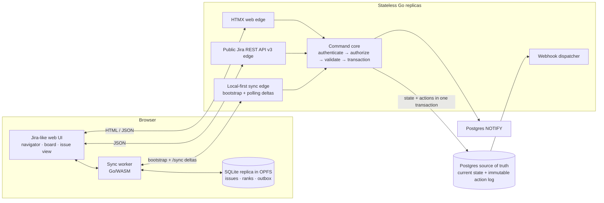

# ZZIRA — Build Plan

A Jira-style issue tracker rebuilt on the delta-sync architecture described in
[Linear's "Rebuilding delta sync read path"](https://linear.app/now/rebuilding-delta-sync-read-path),
**Targeting compatibility with Atlassian's published Jira Cloud REST API** and visually modeled on Jira. Full conformance remains unfinished; see the current scope below.

**Stack:** Go backend + Postgres · HTMX frontend · browser-local SQLite (WASM/OPFS) ·
one isomorphic Go renderer compiled to both a server binary and a client `.wasm`.

## Hard rules (non-negotiable, apply to every PR)

- **No fallbacks.** No silent default-on-error, no "defend in depth" rewrites, no
  best-effort catch-alls. A wrong input is an error, loudly. Fallbacks hide bugs.
- **No deferrals.** No TODO-carrying stubs, no "wire it later," no placeholder
  implementations pretending to work. A slice is done or it doesn't merge.
- **No dead code.** No unused vars/functions/imports kept alive with `var _ =`,
  no debug print leftovers, no speculative branches. If it isn't executed by a
  test or production, it doesn't ship.
- **No swallowed errors.** `if err != nil { _ = err }`-style discards are bugs.
  Errors are returned, wrapped, logged, or handled — exactly one of those.

---

## Current product scope

The 2026-09-05 request expands the target to the whole Jira Cloud surface plus
wiki/Confluence, diagrams/graphs, reports/metrics, custom dashboards, releases,
automation/schedules and app/plugin compatibility. [CLOUD_PARITY.md](docs/CLOUD_PARITY.md)
supersedes the historical exclusions below. Slice completion is not full product
or API conformance.

## Delivery status (historical slices)

| Slice | Status |
|---|---|
| V0 walking skeleton | ✅ done — REST→log→sync→offline replica verified |
| V1 core issue tracking | ✅ done — diffs, comments/ADF, workflow, outbox |
| V2 navigation & search | ✅ done — JQL v1, search APIs, snapshot bootstrap, navigator |
| V3 rich content | ✅ done — ADF subset + editor, attachments, worklogs, renderedFields |
| V4 boards, agile & real-time | ✅ done — LexoRank, sprints, SSE pokes, watchers/notifications |
| V5 platform & admin | ✅ done-proofs — security tombstones, custom fields E2E, webhooks, filters CRUD, workflow schemes + enforcement, roles list |
| V6 long tail | 🟡 configurable dashboards and 16/17 pinned dashboard operations delivered; other long-tail surfaces remain in `api/conformance/MATRIX.md` |

The authoritative endpoint ledger lives in `api/conformance/MATRIX.md`.

---

## 1. Goals and non-goals

### Goals

- **G1 — Local-first reads.** The browser holds a SQLite replica of the user's
  permission-shaped slice of a workspace. Navigation, boards, and issue views work
  offline; reconnecting clients catch up via an ordered delta, never a full reload.
- **G2 — One renderer.** All HTML is produced by a single pure Go package,
  compiled twice: server binary (linux/amd64) and `GOOS=js GOARCH=wasm` for the client.
- **G3 — Stateless, horizontally scalable backend.** Any replica can serve any
  request. No sticky sessions, no in-process session state, no in-process data caches.
- **G4 — Correct, permission-shaped data everywhere.** Client replicas never contain
  data the user cannot see. Revocation emits tombstone actions.
- **G5 — Jira Cloud REST API v3 as a hard contract.** The API Atlassian publishes is
  the spec: same paths, same request/response shapes, same pagination, expansion,
  error, and auth conventions — so existing Jira clients and scripts work against
  ZZIRA unmodified. Conformance is enforced in CI, not aspirational (§10).
- **G6 — Jira-like UI.** The web app reproduces Jira's information architecture and
  visual language (issue navigator, backlog, boards, issue view) on HTMX (§13).
- **G7 — Known escape hatches.** Every anticipated scaling wall has a planned fix
  (posting-list index behind an interface), so we never change the query shape or the
  client contract to scale.
- **G8 — Vertical-slice delivery.** Every slice walks backend → API → frontend
  end-to-end (§17). Nothing is built "in layers" with wiring deferred to a later phase.
- **G9 — Solid, automated frontend testing.** The browser layer is gated by tests on
  every slice: unit tests for the worker/JS glue, fragment-harness interaction tests,
  and Playwright E2E (offline, two-browser, multi-tab, a11y, visual diff) running in
  CI against the real stack. A red frontend gate blocks merge exactly like a backend gate.

### Historical non-goals (superseded by the current product scope)

- Jira Service Management, mobile push, marketplace apps, dashboards/gadgets (last API tier).
- Offline concurrent editing with CRDT merge — writes go through the server
  (single-writer per entity); an offline outbox gives offline-tolerant writes.
- Pixel-perfect cloning. We target structural and visual *resemblance* using our own CSS
  design tokens, not copying Atlassian proprietary assets (fonts, icons, artwork).

---

## 2. Architecture overview



Static UI assets, including the application JavaScript and WASM worker, are content-hashed
and can be served from an immutable CDN. Postgres notifications are a server-side wake-up
hint; the browser replica’s correctness path is its explicit bootstrap and delta polling.

Two structural ideas carried from the Linear post, plus one forced by the API goal:

1. **Storing the log and serving the log are different problems.** Postgres is the
   system of record; the reconnect query (`seq > since ∩ permissions`) lives behind
   the `Syncer` interface — Postgres in v1, posting-list index in v2.
2. **One write path.** The HTMX UI and the REST API are two edges over the same
   **command core**. Every mutation — from a browser form or a `PUT /rest/api/3/issue`
   call — validates through `authz`, mutates state, and appends action(s) *in the same
   transaction*. There is no "API data path" and "UI data path"; there is one log.

---

## 3. Core concepts

| Concept | Definition |
|---|---|
| **Action** | One immutable, ordered record of a change: per-workspace `seq`, entity, op, payload with **field-level diff** (`{field: {from, to, fromString, toString}}`), schema version, actor. This payload shape is deliberate: Jira's `changelog` API bean is derivable from it directly. |
| **Command core** | The single mutation layer (`internal/commands`). Both edges call it; it is the only code allowed to write state or append actions. |
| **Checkpoint** | Client's `MAX(actions.seq)` locally. The whole sync protocol is "everything after my checkpoint." |
| **Sync scope** | Permission-shaped set of actions a user may receive: permission scheme (global/project) + issue security levels. Server-side only. |
| **Subscription** | Voluntary narrowing: watched issues, favorited filters/projects, board membership. |
| **Tombstone action** | Removes previously-visible data from a replica on permission shrink/delete. |
| **Snapshot** | Permission-filtered dump of materialized rows at a known `seq` for bootstrapping. |
| **ADF** | Atlassian Document Format — JSON rich-text model used by Jira v3 for descriptions, comments, worklog comments. Stored verbatim; rendered by our pure Go ADF→HTML renderer (§6). |
| **JQL** | Jira Query Language — the search grammar. Parsed and evaluated server-side (§11). |
| **Rank** | LexoRank-style fractional ordering string per board column, enabling O(1) reorder and the Agile rank API contract (§13). |

---

## 4. Repository layout

```
zzira/
  go.mod                      module zzira
  api/                        PINNED CONTRACT
    jira-v3.json              Atlassian official OpenAPI 3 spec (pinned commit/tag)
    agile-1.0.json            Agile REST API spec (pinned)
    gen/                      oapi-codegen output: edge DTOs + validators
    conformance/              fixture golden pairs, compat-matrix generator
  internal/
    render/                   ← PURE. html/template (embed.FS) + view models → HTML
    adf/                      ← PURE. ADF model → HTML, normalizer, HTML→ADF (subset)
    models/                   shared structs: entities, actions, view models
    actions/                  action schema, versioning, replay/apply helpers (pure)
    authn/                    sessions (cookie), API tokens (Basic), PATs (Bearer)
    authz/                    permission scheme evaluation: user×op×entity → bool
    commands/                 ★ the single mutation layer (used by both edges)
    store/                    Postgres: state tables + action log (server only)
    jql/                      JQL parser, field registry, JQL→SQL compiler (pure core)
    workflow/                 workflow model: statuses, transitions, conditions/validators
    syncapi/                  /sync, /bootstrap, notify pokes; Syncer interface
    api3/                     REST v3 edge: spec DTOs ⇄ commands (thin translation)
    agile/                    Agile 1.0 edge (boards, sprints, rank)
    web/                      HTMX edge: routes, handlers, session middleware
    webhooks/                 log-driven webhook dispatcher (later tier)
    attachments/              object-storage abstraction (S3-compatible / local dev)
    notify/                   notification scheme → in-app notification actions (email later)
    cmd/
      server/main.go          GOOS=linux binary
      client/main.go          GOOS=js GOARCH=wasm: sync worker + SQLite + render + adf
  web/static/                 htmx.js, app.js, worker bootstrap, design tokens CSS
  web/unit/                   Vitest: worker/JS module tests (sync loop, outbox, fragment cache)
  e2e/                        Playwright: per-slice specs, fragment harness specs, a11y + visual diffs
  migrations/
  PLAN.md
```

**Enforced boundary:** `render`, `adf`, `jql` (parser), `models`, `actions` must not
import anything server-only. CI compiles `cmd/client` on every push — a bad import
fails the build.

---

## 5. Data model (Postgres, v1 — representative)

```sql
CREATE TABLE workspaces (
  id   BIGINT GENERATED ALWAYS AS IDENTITY PRIMARY KEY,
  slug TEXT UNIQUE NOT NULL,
  seq  BIGINT NOT NULL DEFAULT 0            -- per-workspace action sequence
);

-- Immutable append-only log. Never UPDATE / DELETE.
CREATE TABLE actions (
  workspace_id BIGINT NOT NULL REFERENCES workspaces(id),
  seq          BIGINT NOT NULL,
  entity_type  TEXT   NOT NULL,             -- issue | comment | worklog | attachment | ...
  entity_id    TEXT   NOT NULL,             -- opaque id ( accountId-style compat )
  op           TEXT   NOT NULL,             -- upsert | delete | tombstone
  schema_v     INT    NOT NULL,
  payload      JSONB  NOT NULL,             -- current-value or field-level diff
  actor_id     TEXT   NOT NULL,
  created_at   TIMESTAMPTZ NOT NULL DEFAULT now(),
  PRIMARY KEY (workspace_id, seq)
);
CREATE INDEX ON actions (workspace_id, entity_type, entity_id, seq DESC);

-- Global config entities (Jira-shaped, admin-managed; NOT synced to client replicas)
CREATE TABLE issue_types (id TEXT PRIMARY KEY, name TEXT, icon TEXT, subtask BOOL);
CREATE TABLE priorities  (id TEXT PRIMARY KEY, name TEXT, icon_url TEXT);
CREATE TABLE statuses    (id TEXT PRIMARY KEY, name TEXT, category TEXT); -- to-do|inprogress|done
CREATE TABLE resolutions (id TEXT PRIMARY KEY, name TEXT);

CREATE TABLE projects (
  id TEXT PRIMARY KEY,                        -- opaque string ids (Jira style)
  workspace_id BIGINT NOT NULL,
  key  TEXT NOT NULL, name TEXT NOT NULL,
  workflow_scheme_id TEXT, permission_scheme_id TEXT, issue_security_scheme_id TEXT,
  UNIQUE (workspace_id, key)
);

CREATE TABLE issues (
  id           TEXT PRIMARY KEY,
  workspace_id BIGINT NOT NULL,
  project_id   TEXT NOT NULL,
  key          TEXT NOT NULL,                 -- ZZ-123
  issuetype_id TEXT NOT NULL,
  summary      TEXT NOT NULL,
  description  JSONB NOT NULL DEFAULT '{}',   -- ADF document, stored verbatim
  status_id    TEXT NOT NULL,
  priority_id  TEXT,
  assignee_id  TEXT,                          -- opaque accountId
  reporter_id  TEXT NOT NULL,
  labels       TEXT[] NOT NULL DEFAULT '{}',
  security_level_id TEXT,                     -- NULL = project-visible
  rank         TEXT NOT NULL DEFAULT '0|hzzzzz:',   -- LexoRank string
  fields       JSONB NOT NULL DEFAULT '{}',   -- custom fields keyed by customfield_NNNNN
  updated_seq  BIGINT NOT NULL,
  updated_at   TIMESTAMPTZ NOT NULL,
  UNIQUE (workspace_id, key)
);
CREATE INDEX ON issues (project_id, status_id, rank);

CREATE TABLE comments  (id TEXT PRIMARY KEY, issue_id TEXT NOT NULL, author_id TEXT,
                        body JSONB NOT NULL, updated_seq BIGINT, updated_at TIMESTAMPTZ);
CREATE TABLE worklogs  (id TEXT PRIMARY KEY, issue_id TEXT NOT NULL, author_id TEXT,
                        time_spent_seconds INT NOT NULL, started TIMESTAMPTZ,
                        comment JSONB, updated_seq BIGINT);
CREATE TABLE attachments (id TEXT PRIMARY KEY, issue_id TEXT NOT NULL, filename TEXT,
                        mime TEXT, size BIGINT, blob_ref TEXT, author_id TEXT, created_at TIMESTAMPTZ);
CREATE TABLE issue_links (id TEXT PRIMARY KEY, link_type TEXT, inward_id TEXT, outward_id TEXT);
CREATE TABLE watchers   (issue_id TEXT, user_id TEXT, PRIMARY KEY (issue_id, user_id));

-- Schemes (Jira-shaped; v1 ships sane defaults, admin APIs in Tier C)
CREATE TABLE permission_schemes     (id TEXT PRIMARY KEY, name TEXT, grants JSONB NOT NULL);
CREATE TABLE issue_security_schemes (id TEXT PRIMARY KEY, project_id TEXT,
                        levels JSONB NOT NULL);           -- level → members
CREATE TABLE workflows      (id TEXT PRIMARY KEY, name TEXT, def JSONB NOT NULL);
CREATE TABLE boards         (id TEXT PRIMARY KEY, project_id TEXT, name TEXT,
                        type TEXT, filter_jql TEXT, column_status_ids TEXT[]);
CREATE TABLE sprints        (id TEXT PRIMARY KEY, board_id TEXT, name TEXT, state TEXT,
                        start_date TIMESTAMPTZ, end_date TIMESTAMPTZ, goal TEXT);
CREATE TABLE sprint_issues  (sprint_id TEXT, issue_id TEXT, rank TEXT, PRIMARY KEY (sprint_id, issue_id));
CREATE TABLE filters        (id TEXT PRIMARY KEY, owner_id TEXT, name TEXT, jql TEXT,
                        favourite BOOL);

CREATE TABLE users (
  id TEXT PRIMARY KEY,                        -- opaque accountId (base32 of internal seq)
  email TEXT UNIQUE NOT NULL, password_hash TEXT NOT NULL,
  display_name TEXT NOT NULL, time_zone TEXT DEFAULT 'UTC', active BOOL DEFAULT TRUE
);
CREATE TABLE sessions    (token_hash TEXT PRIMARY KEY, user_id TEXT, expires_at TIMESTAMPTZ);
CREATE TABLE api_tokens  (id TEXT PRIMARY KEY, user_id TEXT, token_hash TEXT NOT NULL,
                        label TEXT, expires_at TIMESTAMPTZ);   -- Basic auth: email:token
```

### The write transaction (single source of truth for the log)

```sql
BEGIN;
  SELECT seq + 1 INTO new_seq FROM workspaces WHERE id=$1 FOR UPDATE;
  UPDATE issues SET status=$5, updated_seq = new_seq, updated_at = now() WHERE id=$2;
  INSERT INTO actions (workspace_id, seq, entity_type, entity_id, op, schema_v, payload, actor_id)
    VALUES ($1, new_seq, 'issue', $2, 'upsert', 1,
            jsonb_build_object('diff', jsonb_build_object(
              'status', jsonb_build_object('from',$6,'to',$5,
                                           'fromString',$7,'toString',$8))), $3);
  PERFORM pg_notify('ws_' || $1::text, new_seq::text);
COMMIT;
```

The `diff` payload shape is what makes Jira's `GET /issue/{id}/changelog` a *derivable
view* of our log rather than a second data structure.

---

## 6. The isomorphic renderer + ADF

`internal/render` remains the single HTML renderer (server + wasm), and gains a
critical Jira-v3 synergy: **`?renderedFields=true` on the REST API returns HTML for
description/comments — rendered by the exact same code path the client uses locally.**
One renderer guarantees the API, the SSR page, and the offline replica agree byte-for-byte.

- `internal/adf`: pure Go ADF model → HTML renderer. v1 render **subset** (paragraph,
  headings 1–6, bullet/ordered lists, links, strong/em/code/underline/strike, inlineCode,
  codeBlock, blockquote, mentions, dates, emoji, tables, media placeholder → attachment link).
  Unknown ADF nodes render as normalized text (never crash). Normalizer cleans pasted HTML → ADF.
- Authoring: a lightweight contenteditable editor in `app.js` producing the supported
  ADF subset (ProseMirror is Jira's editor — explicitly out of scope).

---

## 7. The client: SQLite replica, sync worker, outbox

Local schema mirrors the server's *materialized* entities only — issues, comments,
worklogs, board ranks, sprint membership, watchers, and the action log tail. Global
config (workflows, schemes, statuses/priorities metadata) is small and readable via
normal API calls; the worker caches it read-only in `meta`-style tables.

Worker responsibilities (single DB owner via Web Locks / SharedWorker):

1. Own OPFS SQLite; tabs are thin views over the worker's MessagePort.
2. `navigator.storage.persist()`; detect eviction → clean re-bootstrap.
3. **Sync loop:** checkpoint → `GET /sync?workspace=W&since=N` → append actions in one
   txn → apply to materialized tables (incl. tombstones, rank updates) → refresh
   fragment cache → dispatch `entity:{type}:{id}` events → HTMX OOB swaps.
4. **Rendering:** fragments from the server when present; otherwise local
   `render.Fragment` from SQLite rows (identical bytes guaranteed by §6).
5. **Outbox drain:** offline commands queue locally; on reconnect, POST in order,
   receive authoritative actions back, drop optimistic state.

Board drag-and-drop writes a rank command; the resulting rank action re-orders cards
on every replica — same sync path as any other change.

---

## 8. Sync protocol

Unchanged from the delta-sync design:

- `GET /sync?workspace={id}&since={seq}&limit={n}` → ordered, permission-filtered
  actions `(since, head]`, with `rendererVersion` banner and `truncated` pagination.
- Determinism: actions immutable, `head` frozen at request time ⇒ response is a pure
  function of `(workspace, since, head)` ⇒ cacheable at the edge, differentially testable.
- `POST /bootstrap` → permission-filtered snapshot + `snapshotSeq`, then tail replay.
- Live: v1 polling with head ETag; v1.5 `pg_notify` pokes → SSE hint → pull `/sync`.

---

## 9. Permissions (Jira-shaped)

`authz` implements Jira's three-level model so both the API contract and the UI agree:

- **Global permissions** (administer, create projects…) from workspace roles.
- **Project permissions** (browse projects, create issues, transition issues…) from
  `permission_schemes.grants` — grant targets: user, group, project role, current assignee,
  reporter. v1: user + reporter + assignee + workspace role.
- **Issue security:** `issue_security_schemes` levels; `issues.security_level_id` gates
  browse. `NULL` = visible to all project browsers.

The `/sync` scope computation uses exactly this evaluation: visible projects ∪
security levels the user belongs to. Jira's `GET /mypermissions` and
`POST /permissions/check` read from the same evaluator — one implementation, three surfaces.

---

## 10. Jira Cloud REST API v3 — the contract

### 10.1 Contract mechanics

- **Pin the spec.** Commit Atlassian's official OpenAPI 3 spec for REST v3 (and Agile
  1.0) under `api/`, pinned to an upstream version. The spec — plus the published
  reference docs where prose overrides schemas (expansion semantics, default fields) —
  is normative. Upgrade = reviewed PR that bumps the pin and the compat matrix.
- **Generated edge types.** `oapi-codegen` generates request/response DTOs + validation
  from the spec into `api/gen`. The edge layer (`internal/api3`) only translates
  DTO ⇄ internal models and calls `commands`. The wire format is correct *by
  construction*; hand-rolled JSON drift is impossible at the edge.
- **Conformance suite in CI** (see §16): fixture goldens, spec-derived validation, and
  an external real-world client (`ctreminiom/go-atlassian`) exercising the API as a
  consumer would. A generated **compat matrix** (`api/conformance/MATRIX.md`) tracks
  every endpoint: ✅ conformant · 🟡 subset · ⛔ not yet.

### 10.2 Conventions to honor (the ones clients actually depend on)

| Convention | Contract |
|---|---|
| Paths | `/rest/api/3/...` and `/rest/agile/1.0/...` served at our origin, verbatim |
| Auth | `Authorization: Basic` (email + API token), `Bearer` (PAT/OAuth-style), or session cookie (UI). 401 vs 403 semantics as published |
| IDs | Opaque string `accountId` / entity ids; path params accept `issueIdOrKey`, `projectIdOrKey` |
| Pagination | Legacy `startAt,maxResults,total,isLast` beans; token pagination (`nextPageToken`) on the new search endpoints |
| Errors | `{"errorMessages": [...], "errors": {"field": "msg"}}` with Jira status semantics (400 validation, 403 permission, 404 not-found-or-no-permission) |
| Expansion | `?expand=changelog,renderedFields,editmeta,operations,...` — whitelisted per resource |
| Fields param | `?fields=summary,status` / `*all` / `*navigable` on issue and search beans |
| ADF | `description`, comment `body`, worklog comments are ADF documents |
| Write semantics | `PUT /issue` update operations: `set/add/remove/edit` per field; `?notifyUsers=false` honored |
| Changelog | `GET /issue/{id}/changelog` derived from the action log (`diff` payloads), paginated identically |

### 10.3 Endpoint tiers (delivery order)

**Tier A — core issue tracking (the spine):**
`serverInfo` · `myself` · `user`, `user/search` · `project`, `project/search` ·
`issue` create/get/put/delete · `issue/{id}/assignee` · `issue/createmeta` (+ per-type
fields) · `issue/{id}/editmeta` · `issue/{id}/transitions` GET/POST ·
`issue/{id}/comment` CRUD · `issue/{id}/changelog` · `issue/{id}/worklog` CRUD ·
`issue/{id}/attachments` + `attachment/content/{id}` · `issueLinkType`, `issueLink` ·
`label` · `issueType`, `priority`, `resolution`, `status`, `statuscategory` metadata ·
`search` (legacy) + `search/jql` + `search/approximate-count` · `mypermissions`,
`permissions/check`.

**Tier B — Agile (`/rest/agile/1.0`):**
`board` CRUD-ish (get/list/create) · `board/{id}/issue` (jql-scoped) ·
`board/{id}/backlog` · `board/{id}/sprint` · `sprint` CRUD + `sprint/{id}/issue` ·
issue `rank` endpoint · epic/issue associations.

**Tier C — platform & config (admin surface):**
`field` (system + custom field CRUD, contexts) · `screen`, `screen/scheme` ·
`fieldconfiguration` · `permissionscheme` · `issuesecurityschemes` · `notificationscheme` ·
`workflow` + `workflowscheme` + project association · `issuetype` schemes · `role` ·
`filter` CRUD + favourites + share permissions · `webhook` registration (+ refresh ping) ·
`avatar` sets · `applicationrole`, `announcementBanner`.

**Tier D — long tail (post-v1):** dashboards & gadgets, announcement/branding details,
dev-status (SCM links), service-management surfaces (explicitly out).

---

## 11. JQL & search

- `internal/jql`: hand-rolled parser (no cgo) → AST → validated against a **field
  registry** (system fields + custom fields) → compiled to SQL with mandatory authz
  predicates injected (search results can never leak).
- v1 operator set: `=, !=, ~, !~, >, >=, <, <=, in, not in, is, is not`, `order by`,
  `and/or/not`, parentheses. Functions v1: `currentUser()`, `empty()`, `membersOf()`,
  `startOfDay()` family, `issueHistory()`. Unparsed/unknown constructs → Jira-shaped 400.
- `~` text search: Postgres `tsvector` GIN on summary/description text extraction —
  good enough until the v2 index, where **search and delta-sync share the same
  posting-list infrastructure** (both are permission-filtered set intersections).
- Saved filters (`filters` table) are entities with their own APIs (Tier C) and
  favourite/subscription semantics feeding `/sync` subscriptions.

---

## 12. Workflow engine

- `workflows.def`: `{statuses, transitions: [{id, name, from[], to, conditions[],
  validators[], screenId?}]}`. v1 condition/validator set: permission checks, field-required,
  resolution-required-on-done. Post-functions v1: set-field, assign-reporter.
- Transitions (REST and UI) go through `commands.TransitionIssue` → engine evaluates →
  emits status/field actions. Transition metadata drives both `GET /transitions`
  responses and the UI buttons — one source.
- Project↔workflow association via schemes (Tier C); v1 ships one default workflow.

---

## 13. Jira-parity UI program

The live gap/status ledger is [docs/UI_PARITY.md](docs/UI_PARITY.md). A parity
claim means the user journey and its API-backed state changes are browser-tested;
visual resemblance alone does not count.

### Design system (own CSS and assets — no proprietary Atlassian assets)

- Palette: ink `#172033`, canvas `#F7F8FA`, surface `#FFFFFF`, action blue
  `#1769E0`, local-replica violet `#6658D3`, navigation `#101828`.
- Type roles: Avenir Next/Segoe UI Variable Display for headings, Inter/system UI
  for body copy, and SFMono/Consolas for keys, counts, JQL, and utility labels.
- Structure: sidebar-first navigation, dense work lists, scroll-contained board
  columns, two-column issue view, status lozenges, accessible modal dialogs, and
  a persistent local-replica status rail. Dark mode uses the same semantic tokens.

### Screen inventory (each screen = fragments + worker events)

| Jira screen | Status | Delivered surface / next gap |
|---|---:|---|
| **Global shell** | ✅ | Sidebar, global JQL search (`/`), create, account, theme, responsive collapse (`Ctrl+[`), live replica state |
| **Projects** | ✅ | Workspace directory, project overview, board/work-item tabs, recent work and workflow context |
| **People and profiles** | ✅ | Workspace people directory plus self/other profiles with visibility-filtered assigned and reported work |
| **Issue navigator** | ✅ | Basic/JQL search, removable chips, saved filters, columns, sorting, pagination, keyboard navigation and contextual preview |
| **Backlog** | ⛔ | Agile APIs exist; no backlog planning UI yet |
| **Board** | 🟡 | Rank/status drag, keyboard move, live convergence, local filter, scroll-contained columns; quick filters, swimlanes, WIP rules and card detail remain |
| **Issue view** | ✅ | Inline system/custom fields, unified activity, comments, attachments, worklogs, history, links, watchers and security-aware actions |
| **Create issue** | ✅ | Shared createmeta schema, project/type, assignment, priority, labels, security, typed custom fields, validation recovery and create-another |
| **Dashboard** | 🟡 | Fixed work overview plus private/shared custom dashboards, favourites, five layouts, native JQL/filter gadgets, accessible charts and refresh; external gadget runtimes and advanced reports remain |
| **Workflow settings** | 🟡 | Workflow directory and diagram, protected default, custom workflow creation, transition editing and project assignment; conditions, statuses and full schemes remain |
| **Project settings** | ⛔ | Workflow assignment is delivered; details, roles, work types, fields, security, boards and webhooks remain |
| **Quick search** | ⛔ | Global JQL submit exists; recent/starred command palette remains |

Keyboard shortcuts currently cover `/` for search and `Ctrl+[` for the sidebar.
Drag-and-drop uses SortableJS → command endpoints and preserves keyboard movement.

---

## 14. Scaling story (deliberate, in order)

1. **Stateless tier:** replicas behind LB; sessions/API tokens in Postgres; notify bus
   in Postgres. Nothing sticky.
2. **Postgres reads:** ordinary reads scale with read replicas. The sync query and JQL
   search do **not** (per-request intersection repeats everywhere — Linear's finding).
3. **v2 index (when p95 > target):** `Syncer` and JQL search both move to a
   posting-list store (turbopuffer or self-hosted). Document = action metadata /
   issue field values; posting lists per security level, project, label, watcher set.
   CDC replicator = singleton deployment, advisory-lock leader election, durable
   offsets, idempotent writes, ~1s p50. **Dual-read cutover:** Postgres head slice ∪
   index history, dedupe by seq, Postgres fallback, shadow-diff validation.
4. Webhook dispatcher (Tier C) is a *consumer of the same action log* — the log's
   pub/sub value compounds: sync, search, webhooks, notifications all read one stream.

```go
type Syncer interface {
    Sync(ctx, wsID, userID int64, since, head int64, limit int) ([]models.Action, error)
    Bootstrap(ctx, wsID, userID int64) (models.Snapshot, error)
}
type Searcher interface {   // same infrastructure, second consumer
    Search(ctx context.Context, u *models.User, q jql.Query, p models.Page) (models.SearchResult, error)
}
```

---

## 15. Security notes

- Permission evaluation **only** server-side (`authz`), shared by `/sync`, REST, web, search.
- API tokens: hashed at rest (`api_tokens.token_hash`); Basic auth over TLS only;
  constant-time comparison; token revocation list check per request (Postgres, cheap).
- Client outbox and REST bodies are equally untrusted — the command core is the wall.
- OPFS replica is same-origin browser storage: permission-shaped data only (tombstones).
- CSRF: SameSite cookies + token on browser POSTs; REST auth paths are header-based and exempt.
- Rate limiting: per-token/per-session counters in Postgres (stateless-friendly);
  move to a shared store if it becomes hot.

---

## 16. Testing strategy

Gates are attached to slices (§17): a slice is not done until its station-7 tests pass
on every layer it touched.

- **Contract/conformance (G5):**
  - Spec validation: generated DTOs validate every request/response in tests.
  - Golden pairs: fixtures captured from a real Jira Cloud sandbox (record: request →
    response JSON), replayed against ZZIRA with a state-seeding script; diff is the
    conformance signal.
  - External consumer: run `ctreminiom/go-atlassian` client suites against ZZIRA.
  - Compat matrix regenerated in CI; Tier-A regressions fail the build.
- **Differential/shadow testing** for any read-path change (sync + search): run both
  implementations, compare results exactly — Linear's shadow-mode discipline.
- **Replay tests:** golden action logs → golden fragment HTML; asserts isomorphic
  renderer byte-equality server vs client.
- **Protocol property test:** for any action stream prefix and checkpoint:
  `snapshot + replay(tail) == replay from zero`.
- **Wasm build gate** in CI on every push.
- **Load tests** at `/sync` and `/search` with 1M-actions/day synthetic workspaces to
  find the p95 knee before production does (sets the v2-index trigger).

### Frontend testing (G9 — non-negotiable)

The architecture makes the frontend unusually testable: the logic is Go; the browser
runs glue + DOM. The pyramid, in order:

1. **Layer 0 — Go logic gates (above).** `render`, `adf`, and `actions/apply` are Go,
   so replay byte-equality already asserts the exact HTML that ships to the browser.
   Anything that can be logic belongs here, not in JS.
2. **Layer 1 — Vitest unit tests for the thin JS layer:** sync-loop state machine,
   outbox drain ordering + retry/backoff (fake timers), fragment-cache keying,
   version-skew decision, event-bus dispatch. The tests prove the glue does nothing
   clever.
3. **Layer 2 — Fragment harness (Playwright).** A debug server route renders any
   fragment with fixture data (`/debug/fragments/{name}`). Specs mount a fragment and
   drive real interactions: dropdown/modal behavior and focus, SortableJS reorder →
   emitted command payload, ADF editor output → ADF JSON. Component testing without a
   JS framework — the harness is our Storybook.
4. **Layer 3 — E2E (Playwright) against the real stack** (compose: server + Postgres +
   MinIO), with the per-slice demo script **being** an automated spec:
   - *Offline:* `context.setOffline(true)` → act → back online → drain asserted (V1)
   - *Two-browser:* two contexts, change propagates ≤1s (V0 create; V4 board drags)
   - *Multi-tab:* two tabs, single DB owner via Web Locks, no duplicate applies
   - *Replay-in-DOM:* seed a fixture action log via the REST API, load the page, assert
     the rendered DOM equals the golden fragment — byte-equality, in a real browser
   - *A11y:* axe-core scans of core screens (navigator, issue view, board) — zero
     critical violations
   - *Visual:* screenshot diffs on core screens at fixed breakpoints — the structural
     Jira-resemblance gate (§13)
5. **Determinism & flake policy:** no arbitrary sleeps (auto-wait + `expect.poll`);
   fixtures seeded through the REST API (dogfoods the contract); trace-on-retry;
   Chromium/Firefox/WebKit matrix with CI sharding; flakes quarantine with a fix
   deadline; frontend gate red ⇒ merge blocked.

---

## 17. Delivery: vertical slices

Every slice is walked **backend → frontend** through the same seven stations. No station
may be deferred — "UI later" and "API later" are forbidden; a slice is done only when a
user can exercise the feature end-to-end, offline included, and every gate is green.

### The seven stations (the pipeline each slice walks)

| # | Station | Layer | Typical content |
|---|---|---|---|
| 1 | store | migrations + queries | schema for the slice's entities |
| 2 | commands | mutation core | validate + authz + txn (state + action + field diff) |
| 3 | sync | log contract | action payload schema + `actions/apply` helper (pure, shared) |
| 4 | api3 | REST edge | spec DTOs, endpoint(s), conformance goldens (when in an API tier) |
| 5 | web | HTMX edge | fragments, forms, interactions |
| 6 | client | wasm worker | replay/apply, fragment cache, offline behavior |
| 7 | gates | tests | replay byte-equality · protocol property · conformance diff · Vitest unit · Playwright E2E (offline / two-browser) · a11y · visual diff |

**Definition of done per slice:** all seven stations touched · the demo script runs
**as an automated Playwright spec** (two browser contexts, one of them offline, where
applicable) · compat matrix updated · no golden regressions · wasm build green.

**Tier traceability:** slices fill the compat matrix tier by tier — V0–V3 ⇒ Tier A,
V4 ⇒ Tier B, V5 ⇒ Tier C, V6 ⇒ Tier D. An API tier is "done" when its slice is.

**Cross-cutting mechanisms** are introduced once, where first needed, then reused
by every later slice:

| Mechanism | Introduced | Thickened in |
|---|---|---|
| Sync loop (checkpoint → replay → swap) | V0 | every slice |
| Authz scope for `/sync` | V0 | V5 |
| Action schema versioning + skip-and-ack | V0 | every slice |
| Renderer version banner + CDN refresh | V0 | V3 |
| Outbox (offline writes) | V1 | — |
| Snapshot bootstrap (snapshot + tail) | V2 | V4 |
| Live pokes (`pg_notify` + SSE) | V4 | — |
| v2 posting-list `Syncer`/`Searcher` | outside slices | trigger-based (§14) |

### The slices (V0–V6)

**V0 — Walking skeleton: "create an issue, see it everywhere."**
The pipe-laying slice; intentionally the largest.
- *Repo/setup:* migrations, compose (Postgres), Makefile (`server`, `client-wasm`,
  `assets`, `test`, `conformance`), pinned Atlassian specs + `oapi-codegen`, CI wasm gate.
- *Stations:* users/sessions + API tokens + Basic auth · `issues` (minimal columns) +
  `actions` · `commands.CreateIssue` · `/sync` + authz scope v0 (workspace membership) ·
  REST `serverInfo`, `myself`, `POST /issue`, `GET /issue/{idOrKey}` · HTMX header + create
  dialog + issue view · wasm worker: OPFS SQLite, Web Locks owner, `persist()`, checkpoint
  poll, replay one action type, local render, OOB swap.
- *Done when:* issue created via **curl against the Jira API** appears in a second
  browser's wasm-rendered view; offline reload still shows it from SQLite; the
  `go-atlassian` client authenticates; replay golden + conformance goldens green.

**V1 — Core issue tracking.** The Tier A spine: issue edit/delete, assignee/reporter,
comments (CRUD; `internal/adf` debuts with paragraph/text/link), default workflow +
`GET/POST /transitions` + status lozenges, history/changelog rendered from action diffs,
and the **outbox** (optimistic UI, queue-in-SQLite, drain-on-reconnect, server-wins
reconciliation). REST: `PUT/DELETE /issue/{idOrKey}`, `editmeta`, comments, transitions.
- *Done when:* airplane-mode demo — create, edit, comment, and transition offline,
  drain in order on reconnect, zero duplicates; changelog endpoint derived from the
  log; all conformance goldens for these endpoints green.

**V2 — Navigation & search.** Users & identity (`user/search`, avatar beans,
accountId discipline, assignee picker), projects REST + project pages, global nav
shell, issue navigator (sortable, filters over the local replica), **snapshot
bootstrap**, JQL v1 (parser + SQL compiler), `search`/`search/jql`/
`approximate-count`, saved filters (read/use).
- *Done when:* fresh client bootstraps a 100k-issue workspace via snapshot + tail,
  not full replay; golden JQL corpus passes with Jira-shaped results and 400s;
  navigator searches offline (replica) and online (server).

**V3 — Rich content.** Full ADF render subset (lists, headings, code, tables,
mentions, emoji), contenteditable editor producing ADF, paste normalization,
`renderedFields=true`, renderer version-skew upgrade exercised; attachments (MinIO,
`X-Atlassian-Token` semantics) + `/worklog` CRUD + issue-view tabs.
- *Done when:* a document authored in ZZIRA round-trips through REST goldens captured
  from real Jira; an API-uploaded attachment shows in the offline replica's metadata
  and re-fetches content on demand.

**V4 — Boards, Agile & real-time.** Boards, columns, LexoRank ordering, SortableJS
drag → rank/transition commands, backlog + sprint views, `pg_notify` + SSE pokes
retire polling, `/rest/agile/1.0` (board, sprint, rank, board issue), watchers +
notification scheme v1 with in-app notifications as a **synced entity**.
- *Done when:* drag in browser A reorders browser B within ~1s via poke-then-pull;
  Agile goldens green; a watch event appears as a notification on all replicas,
  offline-inclusive; snapshot+tail handles the firehose.

**V5 — Platform & admin (Tier C).** Permission schemes (project permissions) +
`mypermissions`/`permissions/check` + `/sync` scope thickened; issue security schemes +
levels; custom fields + contexts (`customfield_NNNNN`, createmeta/editmeta forms,
JQL-filterable); admin scheme APIs (workflow, permission, security, issue-type schemes,
screens-lite, roles); webhook registration + refresh ping + log-driven dispatcher
(exactly-once, replica-restart safe); filters CRUD + favourites + sharing.
- *Done when:* a security-leveled issue vanishes from a non-member's replica via
  tombstone; a custom field created via API is fillable in the UI and filterable via
  JQL; an external integration receives webhooks for offline-then-synced actions;
  Tier C matrix section ✅.

**V6 — Long tail (Tier D).** Dashboards/gadgets (minimal), dev-status stubs, audit
surface, whatever the matrix still shows ⛔ after real usage. *Done when:* matrix has
no surprises; remaining ⛔s are explicitly justified.

**Continuous — scale watch.** Load tests per slice; publish p50/p95 vs workspace size.
*Trigger:* sync/search p95 > 300ms at target size → v2 posting-list
`Syncer`/`Searcher` with dual-read + shadow-diff cutover (§14) — a mechanism swap,
not a slice.

### Cadence

~2–3 weeks per slice for a small team; V0 is the outlier (3–4 weeks — it lays every
pipe). A slice is the unit of review and merge: it lands behind a feature flag, demo
script passes in staging, flag flips. The rule that keeps slices honest: **if station 4,
5, or 6 has nothing to do this slice, the slice is cut wrong** — split it differently.

---

## 18. Risks and mitigations

| Risk | Mitigation |
|---|---|
| API surface enormity (hundreds of endpoints) | Tiered matrix (§10.3) with CI-enforced conformance per tier; contract-first means an endpoint is "done" only when goldens pass |
| Spec drift / upstream changes | Pinned spec version; upgrade = reviewed diff of generated DTOs + matrix re-run |
| JQL breadth | Frozen operator/function list per phase; Jira-shaped 400s for the rest; corpus-driven |
| ADF depth | Render subset + normalized-text fallback; store verbatim so full fidelity is never lost |
| Workflow engine complexity | Conditions/validators/post-functions whitelists per phase; default workflow covers Tier A |
| UI "resemblance" is open-ended | Screen inventory (§13) is the definition of done; structural golden diffs; no proprietary assets |
| Go wasm size / first load | CDN + brotli + immutable; SSR first paint; TinyGo fallback later |
| OPFS multi-tab issues | Single DB owner (SharedWorker/Web Locks); tabs as thin views |
| Storage eviction | `persist()` + eviction detection → clean re-bootstrap |
| Version skew (old renderer/schema) | Schema version per action; skip-and-ack; content-hashed renderer refresh via `/sync` banner |
| The Linear wall (intersection cost) | Planned: `Syncer`/`Searcher` → posting-list index, dual-read cutover (§14) |
| Offline merge temptation | Outbox + server-wins until CRDTs are demonstrated necessary |
| CI browser-test flakiness (wasm/OPFS/timers) | Trace-on-retry, quarantine-with-deadline, real-browser matrix, no arbitrary sleeps (§16) |

---

## 19. Decisions log

| # | Decision | Rationale |
|---|---|---|
| D1 | Action log written in the state-change txn; no CDC in v1 | One moving part; CDC arrives with the v2 index/webhooks as log consumers |
| D2 | Structured action payloads with field-level diffs | Jira `changelog` becomes a derived view of the log, not a second store |
| D3 | Server-authoritative writes; outbox for offline | Offline-tolerant ≠ multi-master; no CRDTs in v1 |
| D4 | Postgres LISTEN/NOTIFY pokes; pull-based deltas | Statelessness without Redis; deltas cacheable |
| D5 | `Syncer` interface from day one; `Searcher` beside it | The blog's lesson: serving the log ≠ storing it; search is the same shape of problem |
| D6 | **Atlassian spec pinned + generated edge DTOs** | Contract enforced by construction, not by review discipline; wire drift impossible at the edge |
| D7 | **REST and web are two edges over one command core** | API clients and browser converge through the same log; no dual write paths to keep consistent |
| D8 | **ADF stored verbatim, rendered by subset renderer** | Lossless future-proofing; unknown nodes degrade gracefully; renderedFields/free |
| D9 | **Own CSS design tokens, Jira-like structure** | Structural resemblance without proprietary asset licensing risk |
| D10 | Opaque string ids (`accountId`-style) at every edge | Jira wire compatibility; internal ints are an implementation detail |
| D11 | Vertical slices through all seven stations (§17) | Every slice ships user-visible, offline-capable value; the log→sync→render pipe cannot rot because every slice walks it |
| D12 | Playwright + Vitest as hard frontend gates (G9, §16) | Frontend correctness is asserted in real browsers (offline, two-browser, a11y, visual); the demo script doubles as the regression spec |
